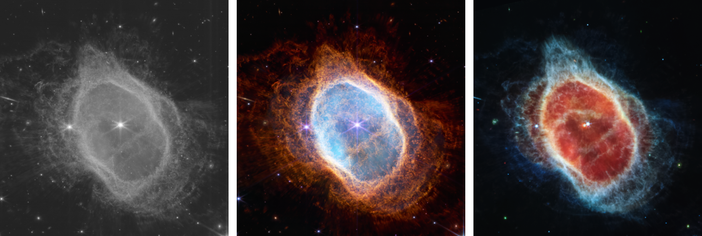

# WEBB
#### A series of six animated and interactive photomontages realized by combining James Webb's stunning photographs with the playfullness of code.

## CONTEXT
The James Webb telescope, launched into space on December 25th, 2022, has been capturing incredible images of our universe, revolutionizing our understanding of its history and composition. The images, taken using infrared light, have stunned both scientists and non-scientists alike with their beauty and the vast amounts of knowledge they have brought to light.

Despite the original photographs are black and white, they represent a broad range of wavelengths that can be reconstructed to create vivid representations of astronomical phenomena. By converting the infrared spectrum to the visible one, the images get coloured, allowing us to see and explore the universe in a completely new way.

## THE PROJECT
The series of photocollages was realized elaborating some of the images taken by the James Webb. The six pictures are organized by the distance of the objects they represent, from those closest to us in space and time to those farthest away.
The first image shows various planets within our solar system; the second offers a glimpse into an exoplanet, an astronomycal object that may be able to support life; the third is a collage of nebulas, dust, and rock conglomerations that give rise to stars; the fourth depicts a black hole, the result of the death of the universe's largest stars, the fifth represents galaxies, while the sixth provides a deep field view of the universe at the beginning of its existence.

## BEYOND THE IMAGES
The final collages were done using p5js, a powerful and user-friendly JavaScript and Processing library developed for creative coding and generative art. To make the pictures the elements taken by James Webb’s original photographs were combined with simple graphics, such as simple shapes and lines, directly generated with the code. 

The final photocollages aren’t scientifically accurate,  but they are not meant to be. The images have been created to conveys the vastness and complexity of our universe through a captivating and interactive experience.

## FINAL CONSIDERATIONS
The collages add a new level to the beauty of the original pictures, transforming the stillness of the wonder they inspire into a creative drive and thirst for knowledge, that find its expression through an interactive experience. 

The intricate shapes and structures captured by the  telescope are almost beyond belief, appearing so complex and detailed that they could have been created by an AI or digital artist rather than by nature itself. Nevertheless, these images are a testament to the immense power and beauty of our universe, gazing at which we are reminded of the sheer scale and grandeur of reality, leaving us with a sense of amazement and appreciation for the cosmos that surrounds us.
